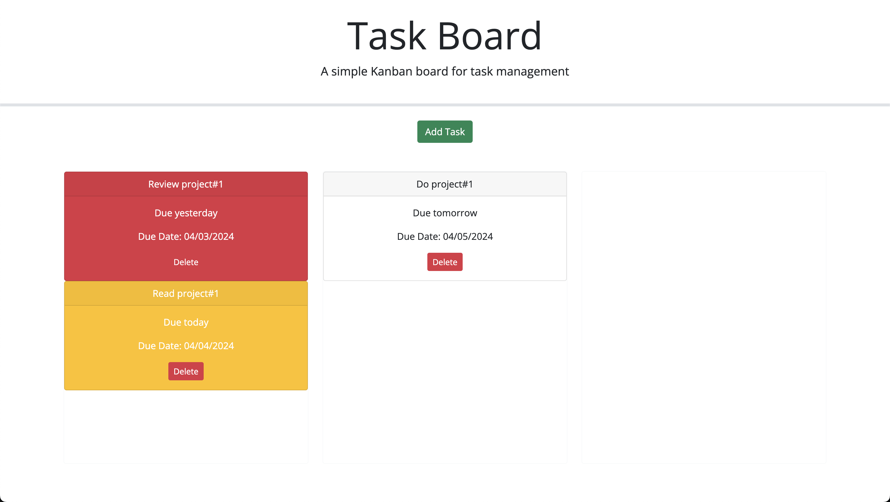

# Task-Board
* As a developer, I made draggable cards across todo board.
* As a developer, I made cards to change colors according to their due dates.
* As a developer, I made a delete button for the cards.
* As a developer, I added modal to add tasks.

Github URL: https://github.com/Sei-cloud/Task-Board
Deployed URL: https://sei-cloud.github.io/Task-Board/Develop

